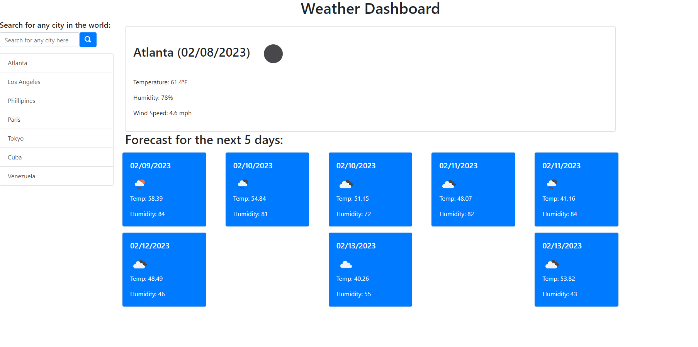

# weather-dashboard-pedro-guerra

## Description

In this bootcamp challenge, the main goal is to build a code that will display weather based on a country or city searched. Once searched, the code will storage the search and show the previous searches. The weather forecast displayed will show the next 5 days of forecast. There was no starter code provided, so all html, css, and javascript will have to be made from scratch.

## Installation

N/A

## Usage

This challenged allowed me to improve my JavaScript, html & css coding skills, as I was had to create a code from scratch. I had a small error where I was showing 7 boxes instead of 5 for the 5 day forecast. Overall, I believe this was a great challenge to practice with javascript and APIs.

Deployed Website Link: <a href="https://pguerra98.github.io/weather-dashboard-pedro-guerra/">Deployed Website Link</a>

## Credits

GA Tech bootcamp

## License

MIT License